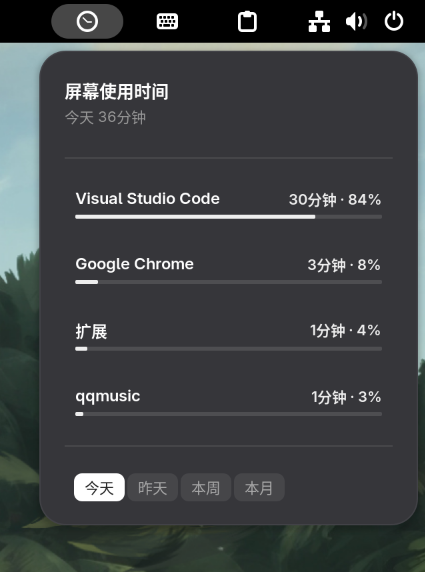
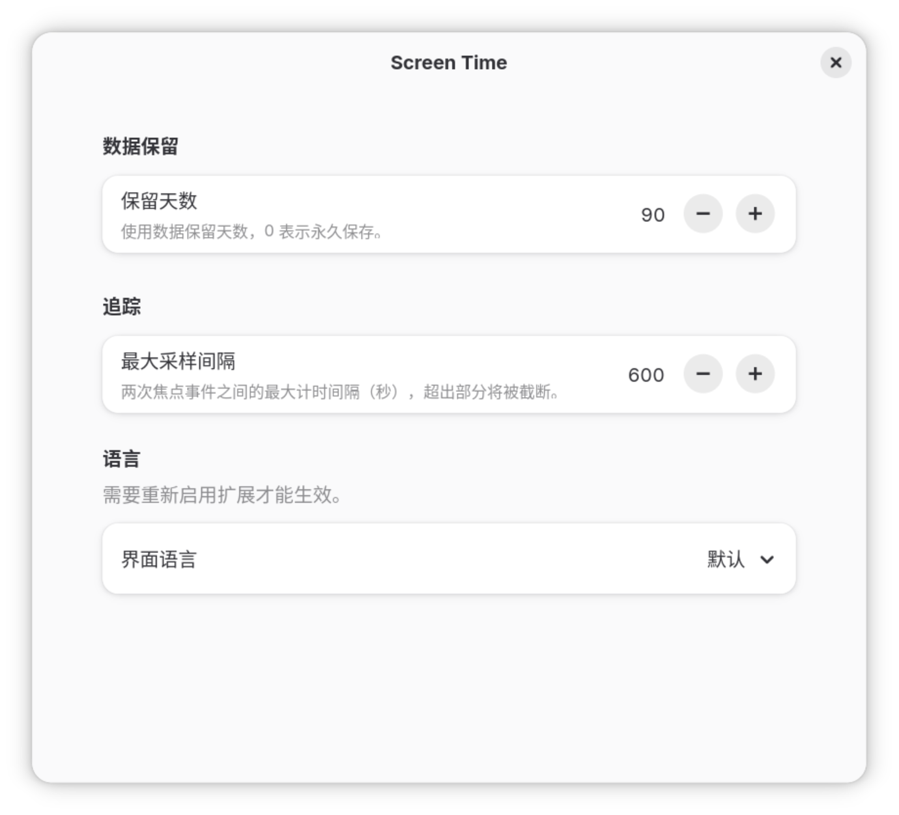

# Screen Time

<p align="center">
  
  
</p>

GNOME Shell 面板上的应用使用时间追踪器，类似 macOS 的屏幕使用时间。


## 功能

- GNOME 面板图标，点击弹出使用时间统计
- 按应用展示今日/昨天/本周/本月使用时长
- 进度条直观显示各应用占比
- 数据本地存储，不联网
- GSettings 配置页面：保留天数、采样间隔、界面语言
- 支持中文 / English 切换

## 支持的版本

GNOME Shell 47 / 48 / 49 / 50

## 安装

### 从 GNOME 扩展商店（推荐）

访问 [Screen Time on GNOME Extensions](https://extensions.gnome.org/extension/10031/screen-time/) 一键安装。

### 从源码

```bash
git clone https://github.com/chalmery/gnome-screen-time.git
cd gnome-screen-time
make all
make install
```

重启 GNOME Shell（`Alt+F2` → `r`），在「扩展」应用中启用即可。

## 开源协议

MIT
